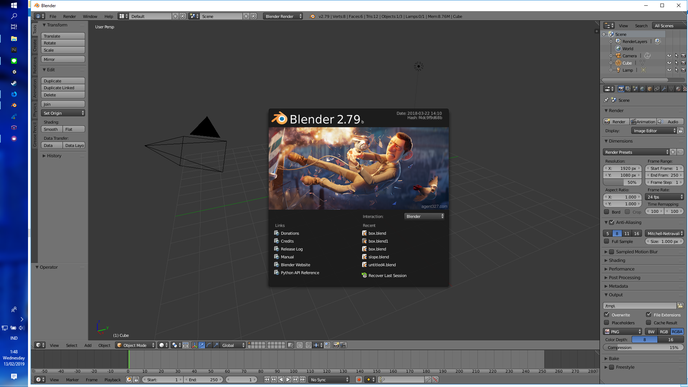
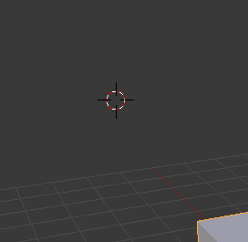
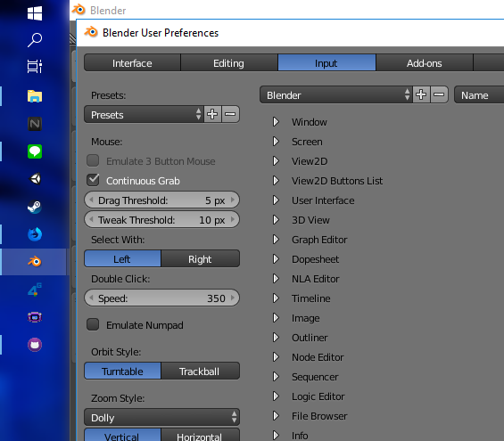
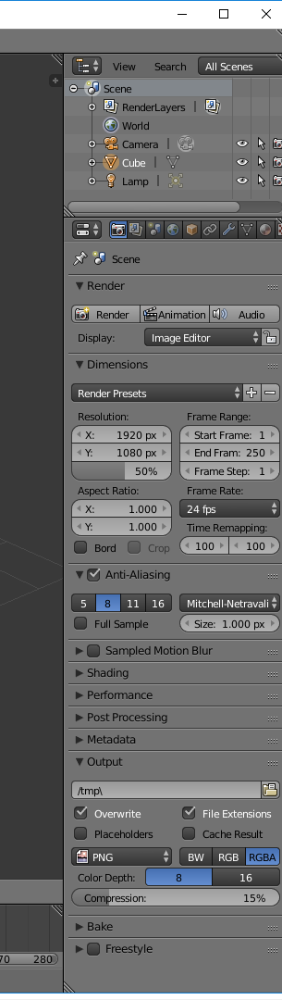
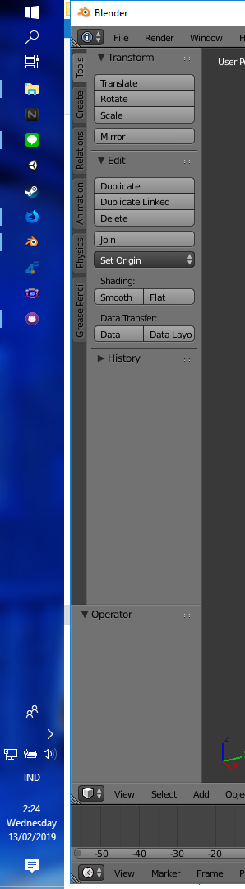

<h3> HCI A  
Nur Muhammad Husnul Habib Yahya  
05111740000094 </h3>   

<h1>Web and application that i think have a <i>Bad Design</i></h1>  

<h2>1. Blender 2.79</h2> 

  I choose this application because, yeah I often use this 3D modelling app when I make game assets for my games. My friend uses it a lot too. And my friend and I agreed some features in this application have a bad design in term of functionality. I will only pick 2 of them for this assignment.

<h3>a. The Right and Left Mouse Click</h3> 

  Usually, whenever we want to select something using our mouse, we will use the left button to select and the right button is well, for something else. <strong>BUT</strong> in Blender 2.79 (I don't know if in the blender 2.8 has changed) the default is when we click left button in attempting to select the object, we didn't select it. Instead of selecting object, the default configuration for left mouse click in blender is changing <i>strange circular thing</i> that we don't know the function or how it will effect our project. To select an object you must click <i>you know what</i>, yes <strong>RIGHT CLICK</strong>. Maaannn, it's something that isn't our habit.

  I know that we can change it in the user preference menu, but it's better that the default is left click is for selecting object and the right-click is for moving that <i>strange circular thing</i>. I recently searched for what is that <i>strange circular thing</i>, it happens to be the anchor of our object, the (0,0,0) position point of our object. But still, I even didn't know that we can swap the left and right click in the setting. So i think it's better that blender use the left click to select as other application is for the default setting

 

<h3>a. The UI for adding object or anything else</h3> 

  When I started using blender, the first impression on this app is very bad because the UI. I think it's not <i>User-Friendly</i>, because how they put the UI for something that we will often use. I don't know how to add object in my project in the first time, then i realized that there is a small tag in the left side with the text "Create" that time i realize that "oh there it is" and it took me a plenty hours to find it. Then when I looked at the right side, there are soo many icons that i don't know what is the function or what should I use when I wanna do something.

 

  Later I found out that the easiest way to navigate through all of function in blender is using Keyboard Shortcut. And yes,l it means that we <strong>HAVE TO REMEMBER</strong> all of the shortcuts to make our life easier when working in blender. When we use shortcuts, we will open a window like <a href="images/blend2.png">this</a> or <a href="images/blend3.png">this</a>.

  I think that maybe blender can use a bigger font or make a better layout for things that we often use when doing a 3d modelling. Or it can use an option to toggle on or of some transparent UI for explaining the keyboard shortcuts or whatever. <a href="videos/blend.mp4">This</a> is a video of what my friend thinks about blender 2.79 especially the things that I have explained above.

